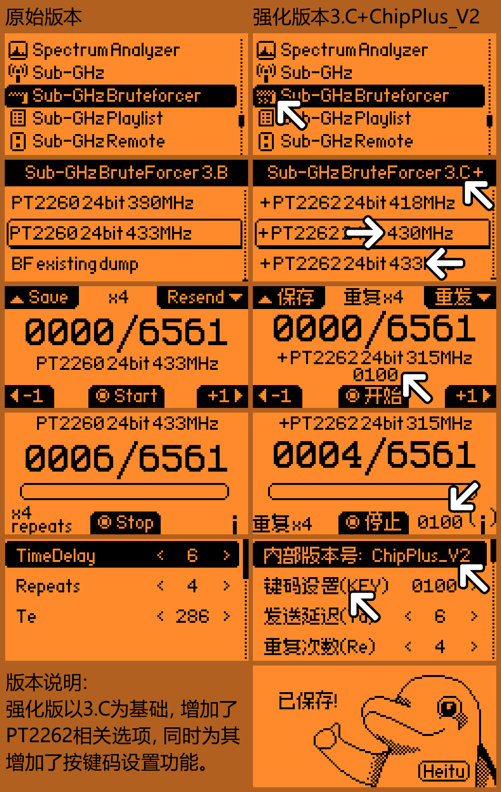
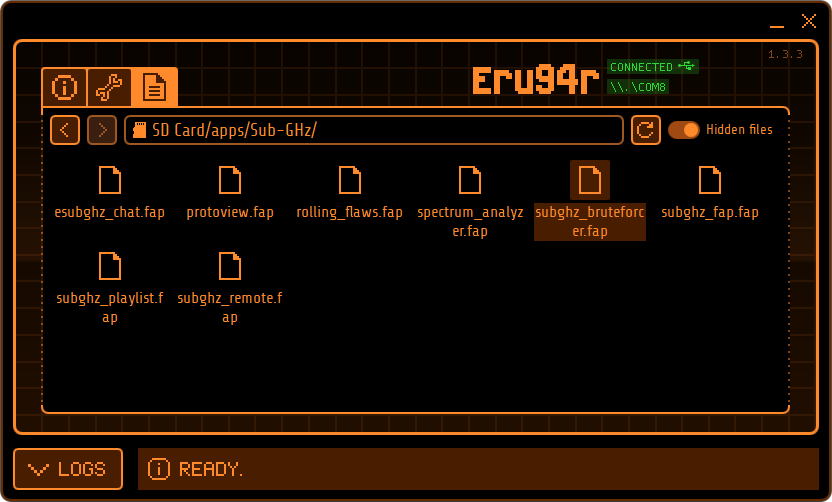

# Sub-GHz_Brruteforcer-ChipPlus 中文强化版

<h2>特别声明：</h2>

<h3>本程序仅限用于个人学习研究，请勿用于其他目的，如用于其他目的，请后果自负，因此导致的后果和责任于本人无关。</h3>

<h2>V2版本说明：</h2>

1、将PT2262支持的4个频率修从315MHz、330MHz、390MHz、433MHz修改更常见的315MHz、418MHz、430MHz、433MHz。
2、将默认发送间隔的Te值修改为更为常用的350。

<h2>程序安装位置：</h2>

<h2>相关说明：</h2>

注释：爆破=暴力破解，一般指利用穷举的方式进行破解。

射频遥控的爆破与其他爆破不同，由于常见射频遥控器的芯片编码数量是固定的，

因此只要时间充足是一定会试出正确遥控编码的。

由于该操作不需要原始遥控器，因此非常适合原始遥控丢失的情况下重配遥控器。

该程序只支持单频扫描，且扫描时间较长，使用时需要有充足的时间和耐性，因此只适用于个人研究学习，以及针对个人遥控设备的盲扫爆破。

<h2>使用说明：</h2>
长按上键打开设置选项，注意！键码的设置选项只有在PT2262里才有。

